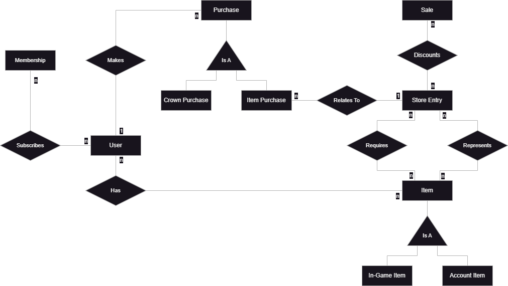
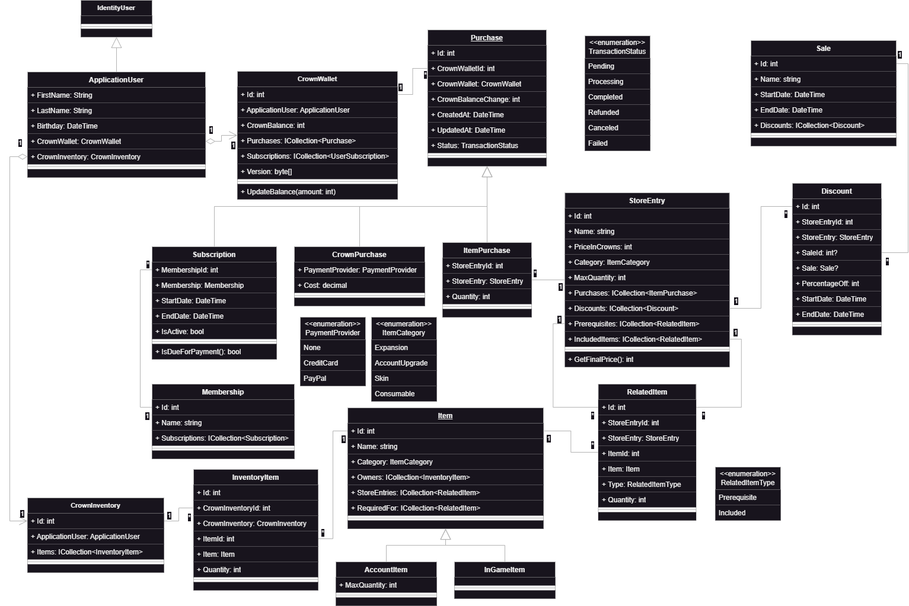

# Crown Shop

An ASP.NET Core MVC project that simulates an online store created for a video-game.

## System description

The system is an online store for the game *The Throne's Tournament*. The user spends real money to buy a premium currency known as *Crown*. With crowns, the user can buy various in-game items, such as skins, consumables and expansions. Some items may have prerequisites, that must be bought first. There is also a subscription system, where users may pay for premium membership.

## Entity-Relationship Conceptual Model

## Models Class Diagram

